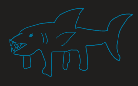

# Session 1 Recap

Starting in Waterdeep on a crisp spring morning, we saw Bliiploolp the Kuo-Toa "pondering" their reflection and making a racket with a drum outside a donut shop. Spurred by the goddess in their reflection (and an upset shopkeeper with a donut bribe), Bliiploolp sought passage on the Gleaming Gander, a carrack preparing for a trade voyage to the United Moonshae Isles. While boarding, Bliiploolp met Ragnar Emberfist, the ship's bosun who offered passage in exchange for work.

As Ragnar was doing his rounds we also met Vish, the ship's surgeon. Vish's qualifications were dubious, but their history with Ragnar was apparent. Ragnar introduced Vish to Carp Enter, another Locathah serving as the ship's carpenter, as well as the intern Lorelei Lithrenni (an actual cleric). Lorelei was very eager to learn from Vish and somewhat naive about the reality of her situation as an underpaid intern to a ~~incompetent~~ dubiously trained but probably not negligent manager. Ragnar showed them to the surgeon's quarters, and before departing he left Vish in on a little secret - layoffs were coming soon, and there were rumblings of a mutiny.

Resuming his duties, Ragnar noticed that the Lateen sail was busted, and called to Rix up in the rigging to get it repaired. Rix was sent down to the quartermaster to get a replacement, and on the way bumped into the twins Snagglefang (the first mate) and Gristlegut (the third mate) who menaced him - but Rix didn't seem to mind too much. Upon reaching the quartermaster we met Guex, a rather aloof Tiefling reading a book while managing the stores. Guex asked Rix if he's here to make another "donation", but Rix was there on other business. Guex called upon his imp familiar Bub to fetch materials to repair the sail, who made a mess of things before producing a needle, some thread, and some slimy cloth. Rix didn't seem to mind the slime, and repaired the sail dutifully.

We then met Captain John Flagherty, a company man seemingly hoarding the wealth of the ship's undertakings. He called all hands on deck and announced layoffs affecting 16 of the ship's crew (but mercifully none of our players). There was a bit of unrest which Ragnar acted quickly to quell, then the ship set sail under the direction of Guy Owain and Devdan Phigwynn, the helmsman and second mate.

As the ship sailed, the crew entered some downtime. The main occurrence was Bliiploolp's fishing antics, which pulled up three legsharks that attacked the crew. They were dispatched handily with a little bit of help from Ragnar, and and investigation into what could have created such a creature led by Guex was unsuccessful.

The journey continued, and on the evening of the seventh day of travel Rix and Bliiploolp saw land while Wish was busy staring off the poop deck. The crew knew this to be the Korinn Archipelago, marking the halfway point of the journey! As night fell a thick fog descended upon the ship, making travel too precarious to continue in the rocky waters. The ship weighed anchor and the crew settled in for the night...

...until Ragnar and Lorelei started noticing some strange signs. First, the mast of a sunken ship rubbing against the hull - this was a ship graveyard. Then, another mast with a Jolly Roger - pirates could be nearby. Then, some creaking off the port bow - was that another ship? And a faint lantern light peeking through the fog - it must be another ship! Bliiploolp then cast Gust of Wind to clear the fog and the crew could clearly see the other ship in the lantern light - pirates were upon them!
