# The Moonshae Isles
(copied and edited from https://forgottenrealms.fandom.com/wiki/Moonshae_Isles - but don’t go read that! There’s some info intentionally omitted!)

>“My journeys to the Moonshaes linger as some of the more fascinating voyages that I have experienced, in a life not entirely devoid of fascination. These isles, so placid and pastoral on the surface, proved to be nests of tension and conflict. I must confess to some surprise as I began to perceive the true capabilities of the peoples of the Moonshaes.”

&nbsp;&nbsp;&nbsp;&nbsp;&nbsp;&nbsp;&nbsp;&nbsp;— Elminster Aumar, Travels Along the Sword Coast

The Moonshae Isles were a collection of islands located west of the Sword Coast where the waters of the Sea of Swords gave way to the Trackless Sea. They were sometimes called "the jewels on the hilts of the Sea of Swords".

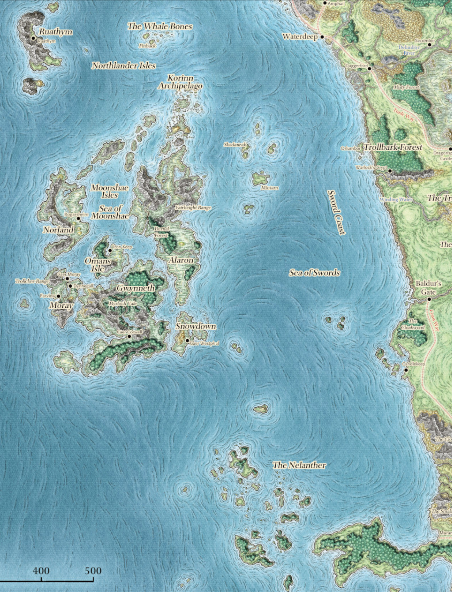
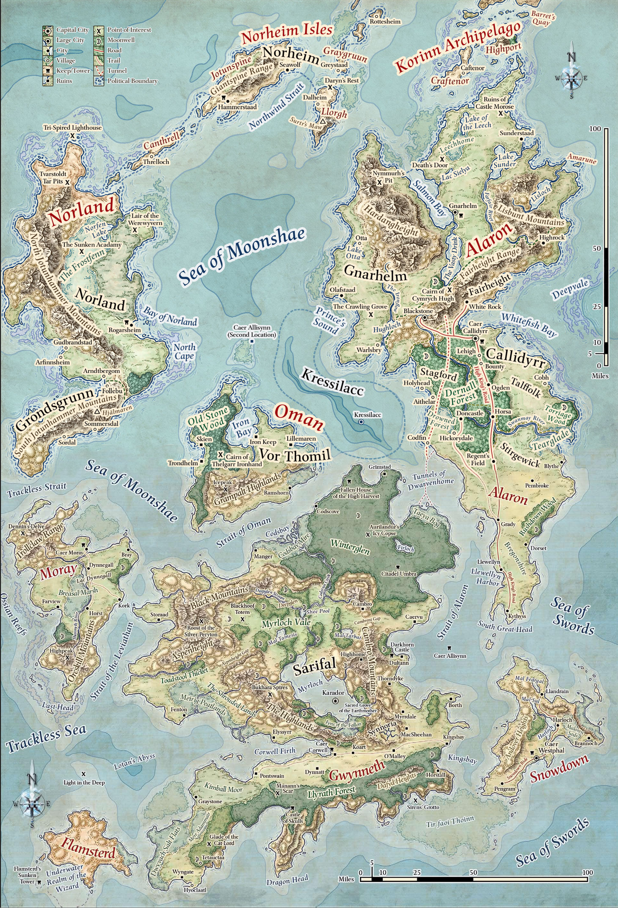

## Notable Islands
The Moonshaes were dominated by six major islands and dozens if not hundreds of minor ones, even the smallest of which often boasted one or two small villages.

### Gwynneth
The largest island in the archipelago and home to the first Ffolk kingdom of Corwell, which was ruled from Caer Corwell. Also known as Sarifal among fey. In the center of the forest is the lake Myrloch, where in ancient times the fey High Lady Ordalf built the now sunken city of Karador.

### Alaron
One of the largest of the Moonshaes, much of the island's north was ruled by the Northlander kingdom of Gnarhelm while the south was under the control of the Kingdom of Callidyrr.

### Norland
Divided into the Northlander realm of Norland in the north and the giant realm of Grondsgrunn in the south.

### Norheim
A series of small islands in the Northern Moonshaes that also formed the Northlander kingdom of Norheim.

### Oman
Once the center of the mighty realm of Oman and a bastion of Northlander culture

### Flamsterd
A desolate and largely destroyed island where monsters occasionally attacked the few settlers that remained. Meanwhile, the flooded southern half comprised the Underwater Realm of the Wizard, the domain of the wizard Flamsterd and other mages who came to study under him.

### Korinn Archipelago
Hundreds of small islands stretched northward from the main archipelago into the Trackless Sea. The isles were favored by pirate bands who preyed on shipping.

### Moray
The westernmost and wildest of the Moonshae isles

### Snowdown
This small isle is sometimes dubbed the Forgotten Isle due to its remoteness.

### Ruathym and Mintarn
In addition to the core Moonshae archipelago, the ancestral home island of the Northlanders, Ruathym, was sometimes regarded as an honorary Moonshae despite being located about 200 miles (320 kilometers) to the north. Likewise, Mintarn and its surrounding islands were sometimes regarded as part of the broader Moonshaes due to their proximity to Alaron.

## Geography

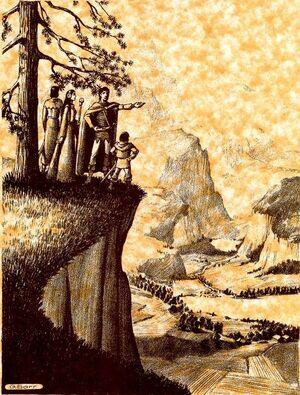

*Adventurers survey the beauty of the Moonshae landscape.*

By the standards of most realms in Faerûn, even the civilized parts of the Moonshae Isles felt untamed and wild. The land was famed for its dark forests, towering mountains, and ancient standing stones. The seas, straights, and channels separating the major and minor islands were treacherous, and served to keep the islands isolated. There were said to be dozens if not hundreds of islands in the archipelago, even the smallest of which often boasted one or two small villages.

Along the coasts, long flat beaches were found. Most lacked sand, and instead comprised pebbles and rocks. Tides were significant among the islands. At low tide, the beaches could be exposed as much as a quarter mile from the waterline. At high tide, the water line could rise up to 10 feet. During storms, the beaches were battered by waves. The coastlines of the islands were dotted with bays and coves, where ships could find a safe harbor from the harsh northern seas. The remaining coastlines were jagged rocks cloaked in mist. Tall cliffs of granite towered over the water, some up to 500 feet in height, capped by forests. These cliffs were worn smooth from exposure to the wind, and in the winter were covered with sheer ice.

Further inland, stagnant saltwater marshes were usually found. These gray and desolate marches lacked trees and an odor of sulfur hung constantly in the air. Traveling in these marshes was hazardous, with about 10% of the terrain being quicksand. Some of the fens and swamps in the Moonshaes rivaled those found in the jungles of Chult. These putrid and decaying swamps were filled with stagnant water. The Fens of the Fallen, on the island of Gwynneth, was likely the most dangerous area in all the Moonshaes.

Freshwater streams were common on the islands. Most were shallow, reaching a maximum depth of 3 feet. Most streams were not safe for boats because of rapids. The islands were home to a handful of rivers, which were deeper and calmer, and safe for boats. Ferries and bridges allowed for safe crossing.

Much of the Moonshaes terrain was moorland. This rolling grassland was dotted with lakes, ponds, and swamps, but most of it was well-drained and dry. The terrain was safe and pleasant and was used as pasture for cattle and sheep.

Mountains and highlands made up another sizable portion of the Moonshaes terrain. These rugged and twisted mountains were jagged and cracked from centuries of erosion. The steep mountains reached 8,000 feet in height. From autumn to early spring, heavy snow covered the highlands, only melting away completely by summer.

### Climate
The climate of the Moonshaes was considered subarctic. The weather was severe and generally unpleasant, with long winters and frequent rainfall. The southeast of the archipelago was more temperate and mild, thanks in part to the northwestern isles taking much of the brunt of the mighty storms that blew in from the Trackless Sea.

During the winter, biting freezing wind roared across the moorlands, as the lack of cover caused the wind to sweep uninterrupted across the exposed terrain. The winter also brought storms to the islands. These storms originated in the Trackless Sea, usually striking the islands from the northwest. Storm season began in late Eleint (equivalent to September) and ended in Ches (equivalent to March). Huge swells reaching 40 feet in height made the sea unnavigable during storm season. However, the oceanic currents created by the meeting of the Sea of Swords and the Trackless Sea served to prevent the temperature from dropping below freezing too often.

Summers tended to be quite cool, wet, and misty. The same oceanic currents that blunted the worst of winter brought a near-constant chance of rain as well as heavy fog that could blanket the whole of the isles in the mornings and evenings.

### Flora & Fauna
The islands were covered with thick deciduous forests of aspen, birch, hickory, maple, oak, and yew. The thick undergrowth made travel difficult unless a game trail or path was found. The plant growth was thick enough at the height of summer to block the wind, holding in the hot and humid air. During the winter, the trees dropped their leaves and the undergrowth died, making travel much easier.

The islands were also home to forests of coniferous trees. Forests of pine, cedar, and spruce had little undergrowth and the forest ground was covered in a thick layer of needles. These forests were usually located in the higher parts of the Moonshaes. During the summer, cool wind swept through the trees, and in the winter the trees acted as a wind block. Klauthgrass was a rare plant that grew in the Moonshae isles, that could be gathered only in full moon nights, and that could be mixed into drinks to obtain a potion that would force people to tell the truth.

The forests of the Moonshaes were home to many animals. In the deciduous forests, smaller animals such as hares, foxes, and ground hogs made their homes. During the summer the forests were filled with insects. The coniferous forests on the other hand were home to large animals such as bears, boar, deer, and wolves with little to no insects.

The saltwater marshes, fens, and swamps were home to swarms of insects. They spawned in the stagnant pools and were generally unpleasant, biting and stinging anyone who traveled the marshes. Dangerous creatures were known to inhabit the dark waters. The freshwater lakes, rivers and streams were home to healthy populations of perch, salmon, and trout.

In the highlands, marmots, mice, and foxes lived in the barren terrain. Cranes, eagles, falcons, and hawks made nests in the cliffs. Some copses of coniferous trees were found here, but usually the only plant life was hardy lichen and mosses. In some areas, vibrant wildflowers appeared for a brief period during the summer.

## Inhabitants
The Moonshae Isles were populated mainly by humans, who far outnumbered the various other races. These humans were split between the Ffolk and the Northlanders, two societies which had been rivals and enemies for centuries. They came to see themselves as complementary stewards of their home, with the Ffolk venerating the land and the Northlanders revering the sea. The bulk of the human population resided on the eastern island of Alaron.

The islands' inhabitants were known to be both physically and spiritually stubborn. Large settlements were rare, and most Moonshavians lived in isolated villages separated by large stretches of harsh landscapes, which often instilled a strong sense of self-reliance and independence in the people. This in turn made them readily suited to life as adventurers should the need arise, with many such Moonshavians favoring the professions of barbarian, bard, druid, or rogue. Both the Ffolk and the Northlanders were skeptical of arcane magic and suspicious of its practitioners, making wizards fairly rare across the isles.

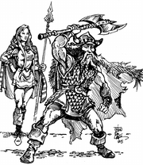

*A Ffolk and a Northlander.*

### Ffolk
The lands of the Ffolk were traditionally those of the southern islands. They were skilled at farming, fishing, and hunting. They were also adept traders. While they were more peaceful than the Northlanders, they were still a strong and hardy folk capable of defending themselves.

### Northlanders
The Northlanders traditionally claimed the northern isles, and were a warrior society ruled by warlord kings. Adventure and combat were an essential part of life for them. Pillaging each other and Ffolk settlements was a regular occurrence. Both the Ffolk and Northlanders were skilled mariners.

### Elves
The original elves of the isles were the Llewyrr, who lived in isolation in their valley of Synnoria on the island of Gwynneth. The same isle also came to be home to avariel, green elves, and wood elves, as well as drow in the Underdark. Elven and half-elven sailors were known to ply the northern seas, and a number of elves from the mainland resided on the isles of Highport and Ventris in the Korinn Archipelago.

### Fey
Fey creatures ranging from playful to sinister called the Moonshaes home. These fey were most commonly found in the realm of Sarifal on Gwynneth and in the Dernall Forest of Alaron. Outside these realms, such fey were known to casually engage with the civilized parts of the Moonshaes.
Gnomes were often regarded as fey within the Moonshae Isles. Many hailed from the Llyrath Forest on Gwynneth or resided on the isle of Chadwick in the Korinn Archipelago. The few gnomes found living among the humans were generally crafters. The most mischievous or adventure-seeking gnomes were sometimes dubbed "fastpaws".

### Dwarves
Like the Llewyrr, dwarves had inhabited the Isles since before the arrival of humans, but were far outnumbered by the 14th century DR. The shield dwarves of the isles were known for their crafting and their warlike culture. They lived mostly in isolated holdings scattered around the isles, the most notable of which was Highhome on Gwynneth and subsequently the Fairheight Range of Alaron. Aside from shield dwarves, Gwynneth was also home to savage tribes of "Greenbeards” and the South Jotunhammer Mountains of Norland were home to duergar. A number of dwarves from the mainland dwelt in Gnarhelm and on the isle of Ventris in the Korinn Archipelago.

### Halflings
Halflings also predated humans in the Moonshaes and legends claimed they had shared roots with the original fey inhabitants. They were famed as merchants, and could generally be found living and doing business nearby to anywhere that the Ffolk had settled. Among the Northlanders, they had notable communities in the Korinn Archipelago on the isles of Caftenor and Ventris.

### Giants
The giants of the Moonshaes found thrill in battle and nursed generations-old grudges. The most notable were the firbolgs, who lived across many of the isles and were ancient enemies of most other groups. They lived in remote areas but would occasionally muster raiding parties to threaten nearby settlements. Owing to a long history of lost wars, lack of leadership, and cruel enslavement by fomorians, the firbolgs of the Moonshaes were more brutish than those of other realms across the sea.

Ettins competed for hunting grounds with the firbolgs. Frost giant tribes inhabited the mountains on Norland, and were respected and revered by the local Northlanders.

Fomorians of Vor Thomil loyal to Queen Connomae conquered the island of Oman just prior to the Spellplague. The formorians came to be loosely allied with the Black Blood tribe. Other groups of fomorians came to occupy the Underdark beneath Gwynneth.

### Orcs
Orcs could most commonly be found in the mountainous parts of the Moonshaes, mostly among the northern isles and on Oman and Moray. Notably, they had been largely wiped out around settled areas by the Northlanders on Norland and by the Ffolk on Snowdown. Half-orcs could be found in towns all throughout the isles, with a notable community on Dennik, and could be found on crews sailing the northern seas.

### Dragons
Blue and white dragons made their homes in the mountains of Norland and several young dragons were known to lair on the isle of Dragonhome. Song dragons, also known as weredragons, were common in the Moonshaes, and their prevalence caused some researchers to theorize that they originated there. The Cult of the Dragon had cells within the Moonshaes, and several dragons as well as dracoliches of the Cult were known to be active in the Isles.

## History
### Ancient History

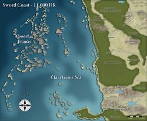

*Map of the Moonshae Isles circa −11,000 DR.*

Circa −15000 DR, fey began settling the Moonshaes. After about 5,000 years, the LeShay founded the kingdom of Sarifal, constructing the city of Karador on an island in the center of the lake within Myrloch Vale. Then, around −9800 DR, Llewyrr refugees began arriving on the islands. They were welcomed by the LeShay, and settled in the mountains and formed the kingdom of Synnoria. In parallel with these migrations, the Children of the Earthmother also arrived in the Isles.

Circa −6000 DR, Grond Peaksmasher arrived in the Moonshaes, accompanied by a tribe of giants who settled on Norland in the Jotunhammer Mountains. After conflict erupted between the dwarves and firbolgs, Grond Peaksmasher was imprisoned. Without his guidance, the firbolgs of the Moonshaes became uncivilized.

Malar (a god of bestial savagery) unleashed his aspect Kazgaroth to wreak havoc on the Moonshaes for the first time circa −2000 DR. The Children of the Earthmother united with the Llewyrr and dwarves to battle the Beast, while it brought fomorians from the Feywild to be its allies. The conflict dragged on for decades until the minions of Kazgaroth were driven to isolated corners of the Moonshaes. The fomorians conquered the firbolgs, forcing them into slavery. In the aftermath of this conflict, Sarifal fell into decline. Circa −500 DR, most of the fey, including the fomorians, abandoned their domains in the Moonshaes and retreated back into the Feywild. The kingdom of Sarifal was abandoned and the city of Karador sank into the Myrloch.

### Early History
Since the days of Sarifal, the humans of the Trackless Sea had long avoided settling the Moonshaes, believing them to be cursed and fearing the fey tricksters who had resided there. Thus, humans did not arrive in the Moonshaes until the Year of the Executioner, 140 DR, when refugees fleeing from the persecution of the Shadowking crossed the Sea of Swords and settled on the island of Gwynneth, beginning the race of the Ffolk. They were led by the First Dynasty of the Moonshaes, and soon came into conflict with Synnoria.

In the Year of the Dwarf, 149 DR, the human settlements of Gwynneth united to form the kingdom of Corwell, which soon fell into civil war until the Year of the Troublesome Vixen, 177 DR, when it was reunited under King Callidyrr Hugh. In the Year of the Student, 201 DR, Bhaal took control of Kazgaroth, sending it to destroy the Ffolk. Callidyrr's son, Cymrych Hugh, defeated Kazgaroth and was crowned High King of the Ffolk, founding the Cymrych Dynasty. Moonshae Reckoning (MR) marks this year as year one on the Moonshavian calendar.

In the Year of the Storm Crown, 250 DR, High King Cymrych Hugh died and was entombed within a barrow mound near Blackstone. His heirs lacked a strong claim to the throne, and as a result the kingdoms of the Moonshaes splintered. The situation worsened in the Year of the Thousand Snows, 256 DR, when Illuskan sailors from Tuern and Gundarlun arrived in the Moonshaes, beginning centuries of Northmen raiding and tribute collecting from the divided Ffolk realms.

In the Year of the Waking Dreams, 289 DR, High King Gwylloch waged successful wars against both the Northmen and his rebellious subjects. He constructed the Castle of Skulls from the skulls of his enemies, where he held court and brought his enemies to die in the Circus Bizarre. He and his son eventually went mad.

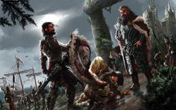

*Prince Ketheryll brings Durnhal and Morgan of Corwell before High King Gwylloch of the Moonshae Isles for his judgment (295 DR).*

In the Year of Four Winds, 467 DR, a large group of immigrants from Tethyr arrived on the islands and settled among the Ffolk. The newly arrived Tethyrians brought their religious beliefs with them, but most Ffolk maintained their faith in the Earthmother. Architects and engineers among the immigrants shared their knowledge with the Ffolk, allowing the Ffolk to construct improved defensive fortifications. As a result, raids from Northlanders dropped over the next few centuries.

In the Year of the False Smile, 852 DR, an Illuskan fleet of longships invaded the Moonshaes. High King Dolan Cymrych was killed when his small fleet of coracles was destroyed in Whitefish Bay. By 944 DR, the Ffolk had surrendered the northern islands to the Illuskan invaders. This marked the end of the Cymrych Dynasty of High Kings and the start of the Carrathal Dynasty, who were High Kings in name only.

### Modern History
#### Darkwalker War

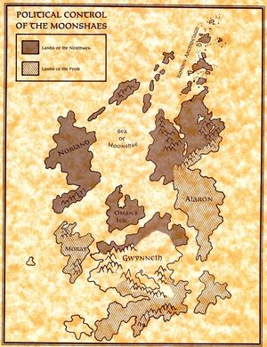

*Control of the Moonshae Isles between the Northmen and the Ffolk kingdoms as of the start of the Darkwalker War.*

The Northmen were a violent, war-like society with little interest in or tolerance of the Ffolk's monarchical ways. Historically, this created a continuous tension between the two human peoples, with Northmen raids on Ffolk farmsteads a common occurrence. In the mid–14th century DR, this conflict escalated into what was termed the Darkwalker Wars, which lasted a number of years. In the Year of the Saddle, 1345 DR, Grunnarch the Red brought his host of longships to Thelgaar Ironhand's Iron Keep on Oman's Isle to prepare an attack on the southern Moonshaes. In the first council of northern Kings and Captains, Thelgaar announced his intention of making long-lasting peace with the Ffolk and starting a prosperous trading relationship. But most of the warriors present disagreed and decided to go along with the plan to raid and pillage the cities of Caer Corwell and Caer Callidyrr and the rest of the Ffolk lands. That same night, Thelgaar was slain by Kazgaroth, who took the identity of the king and supported the attack on Caer Corwell.

En route to Caer Corwell, Kazgaroth, in Thelgaar's shape, challenged and killed the Leviathan, one of the children of the goddess Earthmother. Around the town and fortress of Caer Corwell, the Northmen were halted by the combined forces of Prince Tristan Kendrick and his companions. They would go on to slay Kazgaroth.

By the Year of the Bright Blade, 1347 DR, Tristan had claimed the title of High King of the Ffolk, and forged a peace agreement with many of the Northlander kingdoms known as the Treaty of Oman.

The Moonshae's struggles against evil attracted the concern of the Harpers, who expanded their presence in the isles.

#### Talos
In the Year of the Sword, 1365 DR, Robyn Kendrick sensed the imminent return of the Earthmother to the Moonshaes. Angered by her return, the god Talos attempted to throw the islands into chaos by turning the Ffolk and Northlanders against each other again. To achieve this goal, Talos recruited an army of pirates, sahuagin from Kressilacc ,and even a dracolich named Gotha. Princess Deirdre Kendrick aided in the release of the avatar of Grond Peaksmasher. She was corrupted by Talos and was later killed by her sister Alicia Kendrick.

Alicia Kendrick was crowned High Queen after High King Tristan Kendrick abdicated his claim to the throne to be with his wife, Queen Robyn. She had left the capital to live in Myrloch Vale in order to commune with the Earthmother.

#### United Moonshae Isles
The conflict between the Northlanders and the Ffolk waned with the hard work of High King Tristan Kendrick and later through his daughter, High Queen Alicia Kendrick. In the Year of the Unstrung Harp, 1371 DR, Northlander kings swore fealty to Alicia, creating the United Moonshae Isles. This marked the first time that Ffolk and Northlanders were truly united, and intermarriage between the Ffolk and the Northlanders of Alaron began to erode some cultural differences between them. The Northlander kings adopted the title of "Jarl" and continued to rule their kingdoms as vassals. While not all Northlanders ceased their raids on the Ffolk, and while some petty lords continued to feud between themselves, the bigger threat to peace at this time was the risk of pirate attacks out of the nearby Nelanther Isles.

#### Invasions from the Feywild

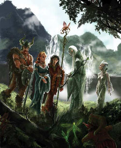

*The leShay High Lady Ordalf announces the rebirth of Sarifal.*

Beginning in the Year of the Banner, 1368 DR, the wardens of the druid groves in Myrloch Vale had started to vanish after receiving summons to enter the moonwells. In the Year of the Gauntlet, 1369 DR, Robyn and Tristan Kendrick entered the Great Moonwell in Myrloch Vale to investigate the vanishing druids. They ended up in the Feywild. By 1370 DR, fey had begun to arrive in the Moonshaes, traveling through the moonwells. They settled primarily in Myrloch Vale and Winterglen Forest.

## Religion

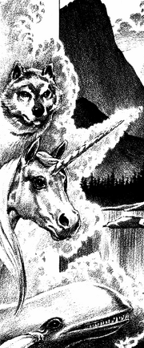

*The three mortal servants of the Earthmother: the Leviathan, the Unicorn, and The Pack.*

The Earthmother was worshiped exclusively by the Ffolk of the Moonshae Isles. Rather than clerics, she was venerated by druids at sacred pools known as moonwells. She was widely believed to be an aspect of the deity Chauntea, however this view was not shared by many of the Ffolk. The isles were one of the greatest centers of druidic power in all of Faerûn, although the druids of the Moonshaes considered themselves largely distinct from the druids of the mainland. The only other god known to be acknowledged by the druids of the Moonshaes was Silvanus.

In the 14th century DR, Northlanders primarily worshiped a storm-themed aspect of Tempus who drove them to raid and plunder their neighbors. They also worshiped the Auril and Umberlee, and some were also known to venerate Valkur. The worship of these gods was often little more than cursory for the Northlanders and dependent upon whether or not they were residing in the god's sphere of influence.

Starting around 1256 DR, clerics from various faiths began visiting the Isles, with the goal of converting the islanders to their faith and establishing churches. The reactions of the islanders were mixed, with the Northlanders killing the clerics while the Ffolk generally considered the clerics harmless and a source of entertainment. The foreign clerics successfully converted a handful of Ffolk, but the vast majority of the Ffolk remained faithful to their traditional religion.

In 1358 DR, during the Time of Troubles, Bhaal was banished from the Moonshaes. In 1359 DR, priests of the Risen Cult of Bane led by the cleric Gauntather began establishing themselves on the Moonshae Isles. Their goal was to transform the islands into a kingdom led by the Cult.

Worship of Yondalla, who was known locally as Perissa, was common among the halflings who inhabited the Moonshaes.

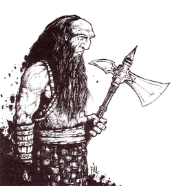

*Grond Peaksmasher, patron demigod of the firbolgs of the Moonshae Isles.*

The firbolgs of the Moonshaes worshiped the demigod Grond Peaksmasher, thought by religious scholars to be the son of Hiatea. While in truth the firbolgs were descendants of Othea and Ulutiu, the firbolgs of the Moonshaes believed that Grond carved them from stone and that the dwarves were the result of the "leftovers" of this process. Before Grond was reawakened, many of the firbolgs of the Isles were ruled by Kazgaroth, an aspect of Malar, while others venerated the Earthmother.

## Government

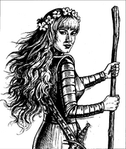

*Alicia Kendrick, High Queen of the Moonshae Isles.*

Despite its wild and untamed reputation, the Moonshae Isles were and had long been rife with political intrigue and infighting between the various kingdoms and islands. The land was historically divided among more than a dozen squabbling kingdoms, not to mention the unaligned strongholds of dwarves and giants throughout the mountains. It was said that a claim had already been made on every corner of the vast wilderness of the islands, although this included the island's druids who served as protectors of its woodlands and had to be consulted before felling any tree.

In 1371 DR, the majority of the Moonshae Isles came together to form the United Moonshae Isles under High Queen Alicia Kendrick, who ruled from the capital city of Caer Callidyrr on Alaron. The warlords who ruled the Northlanders (who had long styled themselves as "kings") adopted a new title of "jarl" to denote their vassal status.

## Trade

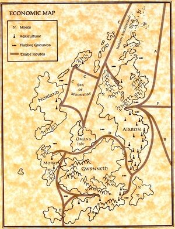

*Trade routes between the Moonshae Isles and toward the Sword Coast, Calimshan, and Mintarn as of the mid–14th century DR.*

Each kingdom of the Moonshaes, while somewhat self-sufficient, had some amount of trade with one another. Most goods traveled on ships from port to port, although some overland trade occurred between realms that shared an island. Nearly all sea trade occurred during summer, with traffic falling by half during the spring and autumn and brought to a halt by the fierce winters. Even as enemies, the Ffolk and Northlanders were known to engage in commerce with each other, albeit warily.

The major external trading partners of the Ffolk were Amn, Calimshan, Mintarn, Tethyr, and Waterdeep. Pirates threatened the waters around the Moonshaes, but the Isles benefitted from providing a relatively safer route up and down the Sword Coast as compared to sailing through the Nelanther Isles, thus making Ffolk ports a common stopover between the North and Calimshan. Caer Callidyrr, with its sprawling and accessible port, was the main commerce and trading hub of the Moonshaes. Merchants from all over Toril could be encountered here. Exported goods bound for Waterdeep or Calimshan were shipped from the city, and imports from outside were brought in. The Moonshaes were one of the few lands where ships from Evermeet (the last true kingdom of the Elves, located far to the west across the Trackless Sea) were known to call.

Waterdhavian merchants sought to trade cloth, oil, or spice for high-quality steel crafted by the Ffolk. Calishite merchants brought horses, parchment, silks, and spices in their galleons. The southern merchants sought fur, metals and weapons. Timber from the islands was in high demand, as it was the only easily accessible location for the large trees required to build galleons. Some Calishite merchants sailed the extra week to trade in the ports on Corwell or Moray.

Some Waterdhavians also stopped in the ports of the Northlanders, who mostly otherwise traded with Ruathym. The Northmen traded slaves and Ffolk weapons for alcohol, cloth, gold, and oil.

The inhabitants of the Moonshaes were wary of cold-hearted merchants who sought only to pillage their natural resources for financial gain. Tarnian shipbuilders from Mintarn, an island that had exhausted its supply of timber, were a frequent sight in Caer Callidyrr. They arrived in the city, purchased enough raw materials to build another ship, then sailed back to Mintarn in both vessels.

Moonshavian merchants brought ale and livestock from Corwell, and coral and iron ore from Moray, to Caer Callidyrr to be traded for high-quality weapons. By the late 14th century DR, the Moonshae had an established gold mining and minting industry. The Moonshae gold had a unique telltale tint – rose, the shade found nowhere else in the Realms. Occasionally, the Moonshae gold was used to create enchanted jewelry that could be found as far as the mage nation of Halruaa. However, Moonshae gold was considered to be of lesser quality than gold jewelry of Halruaa.